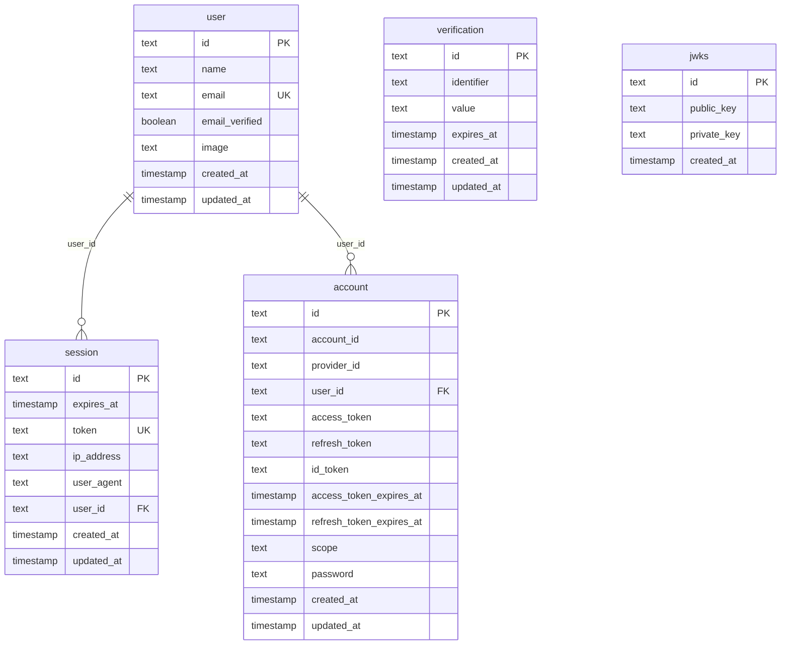

# MSPR HealthAI Coach - AUTH

Microservice d'authentification autonome pour la plateforme HealthAI Coach.

Stack : Bun + Hono + better-auth + Drizzle ORM + PostgreSQL 17.

Ce service est independant : il embarque sa propre base de donnees et ne depend d'aucun autre microservice.
Il expose des JWT signés que les autres services peuvent verifier avec `BETTER_AUTH_SECRET`.

## Demarrage

```bash
cp .env.example .env
# Remplir BETTER_AUTH_SECRET (min 32 chars) et RESEND_API_KEY
docker compose up -d
```

Les deux containers (auth-db + auth-service) demarrent automatiquement.

## Variables d'environnement

| Variable | Defaut | Description |
|----------|--------|-------------|
| `DATABASE_URL` | voir .env.example | URL de connexion PostgreSQL |
| `BETTER_AUTH_URL` | `http://localhost:3000` | URL publique du service |
| `BETTER_AUTH_SECRET` | - | Secret JWT (min 32 chars, obligatoire) |
| `RESEND_API_KEY` | - | Cle API Resend pour les emails |
| `CORS_ORIGIN` | `http://localhost:5173` | Origine autorisee en CORS |
| `ADMIN_EMAILS` | - | Liste d'emails admins separee par virgule pour l'endpoint de simulation Premium |
| `DB_USER` | `root` | Utilisateur PostgreSQL |
| `DB_PASSWORD` | `password` | Mot de passe PostgreSQL |
| `DB_NAME` | `auth_db` | Nom de la base |

## Endpoints

| Methode | Route | Description |
|---------|-------|-------------|
| POST/GET | `/api/auth/*` | Handler better-auth (signup, signin, verify email, reset password...) |
| GET | `/api/auth/ok` | Healthcheck |
| GET | `/api/auth/reference` | Documentation OpenAPI |
| GET | `/api/session` | Session courante (cookie requis) |
| GET | `/api/jwt` | Genere un JWT signe pour les autres microservices |
| PATCH | `/api/admin/users/:userId/subscription` | **Simulation MSPR** : passe un user en `free`/`premium`/`premium_plus` (admin uniquement) |

## Simulation Premium (demo MSPR2)

L'endpoint `PATCH /api/admin/users/:userId/subscription` permet de simuler le passage d'un utilisateur en Premium ou Premium+ pour la soutenance, sans integrer un vrai systeme de paiement. Une integration Stripe via webhook restera triviale en production (meme update sur la table `user_subscriptions`).

### Acces

L'appelant doit presenter un Bearer JWT dont l'email est present dans `ADMIN_EMAILS` (liste comma-separee). En cas contraire :
- Pas d'`Authorization: Bearer ...` ou signature invalide → `401`
- JWT valide mais email non admin → `403`

### Requete

```http
PATCH /api/admin/users/<user_id>/subscription
Authorization: Bearer <jwt_admin>
Content-Type: application/json

{
  "tier": "premium",
  "expires_at": "2027-04-28T12:00:00Z"
}
```

`tier` ∈ `{"free", "premium", "premium_plus"}`. `expires_at` accepte `null` pour un upgrade sans date d'expiration.

### Reponses

- `200` : ligne `user_subscriptions` mise a jour serialisee en snake_case.
- `400` : tier invalide ou `expires_at` non parseable.
- `404` : aucun utilisateur correspondant.

### Audit

Chaque appel reussi logge sur `stdout` une entree JSON structuree :

```json
{"event":"admin.subscription_change","actor_email":"...","target_user_id":"...","old_tier":"...","new_tier":"...","timestamp":"..."}
```

## Integration avec les autres microservices

Le endpoint `GET /api/jwt` retourne un JWT signe avec `BETTER_AUTH_SECRET`.
Les autres services verifient ce token avec la meme cle secrete.

```json
{ "token": "<jwt>" }
```

Payload du JWT :
```json
{ "sub": "<user_id>", "email": "...", "name": "...", "exp": "<timestamp>" }
```

## Schema de la base de donnees



## Migrations

Les migrations Drizzle sont dans `src/db/migrations/` et s'appliquent via :

```bash
bun run db:migrate
```

## Ports

| Service | Port hote |
|---------|-----------|
| auth-service | 3000 |
| auth-db (PostgreSQL 17) | 5433 |
